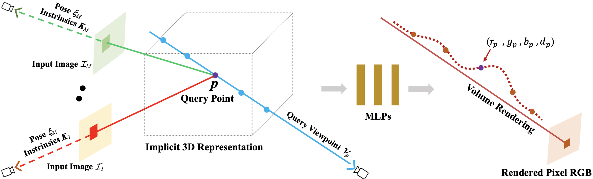

# GRF: Learning a General Radiance Field for 3D Representation and Rendering
### [[Paper](https://arxiv.org/abs/2010.04595)\] \[[Video Results](https://drive.google.com/file/d/1H2FNeAsKoQqCsO0n7PiA1HcT1ingnwJd/view?usp=sharing)\]
[GRF: Learning a General Radiance Field for 3D Representation and Rendering](https://github.com/alextrevithick/GRF)  
 [Alex Trevithick](https://alextrevithick.github.io/)<sup>1,2</sup> and
 [Bo Yang](https://yang7879.github.io/)<sup>2,3</sup>
 <br>
 <sup>1</sup>Williams College, <sup>2</sup>University of Oxford, <sup>3</sup>The Hong Kong Polytechnic University 
in ICCV 2021

This the codebase which is currently a work in progress. 



## Overview of GRF
GRF is a powerful implicit neural function that can represent and render arbitrarily complex 3D scenes in a single network only from 2D observations. GRF takes a set of posed 2D images as input, constructs an internal representation for each 3D point of the scene, and renders the corresponding appearance and geometry of any 3D point viewing from an arbitrary angle. The key to our approach is to explicitly integrate the principle of multi-view geometry to obtain features representative of an entire ray from a given viewpoint. Thus, in a single forward pass to render a scene from a novel view, GRF takes some views of that scene as input, computes per-pixel pose-aware features for each ray from the given viewpoints through the image plane at that pixel, and then uses those features to predict the volumetric density and rgb values of points in 3D space. Volumetric rendering is then applied.

## Setting Up the Environment

Use conda to setup an environment as follows:
```
conda env create -f environment.yml
conda activate grf
```

## Data
* SRN cars and chairs datasets can be downloaded from the paper's drive [link](https://drive.google.com/drive/folders/1OkYgeRcIcLOFu1ft5mRODWNQaPJ0ps90)
* NeRF-Synthetic and LLFF datasets can be downloaded from the NeRF drive [link](https://drive.google.com/drive/folders/128yBriW1IG_3NJ5Rp7APSTZsJqdJdfc1)
* MultiShapenet dataset can be downloaded from the DISN drive [link](https://github.com/Xharlie/ShapenetRender_more_variation)

## Training and Rendering from the Model
To train and render from the model, use the run.py script

```
python run.py --data_root [path to directory with dataset] ] \
    --expname [experiment name]
    --basedir [where to store ckpts and logs]
    --datadir [input data directory]
    --netdepth [layers in network]
    --netwidth [channels per layer]
    --netdepth_fine [layers in fine network]
    --netwidth_fine [channels per layer in fine network]
    --N_rand [batch size (number of random rays per gradient step)]
    --lrate [learning rate]
    --lrate_decay [exponential learning rate decay (in 1000s)]
    --chunk [number of rays processed in parallel, decrease if running out of memory]
    --netchunk [number of pts sent through network in parallel, decrease if running out of memory]
    --no_batching [only take random rays from 1 image at a time]
    --no_reload [do not reload weights from saved ckpt]
    --ft_path [specific weights npy file to reload for coarse network]
    --random_seed [fix random seed for repeatability]
    --precrop_iters [number of steps to train on central crops]
    --precrop_frac [fraction of img taken for central crops]
    --N_samples [number of coarse samples per ray]
    --N_importance [number of additional fine samples per ray]
    --perturb [set to 0. for no jitter, 1. for jitter]
    --use_viewdirs [use full 5D input instead of 3D]
    --i_embed [set 0 for default positional encoding, -1 for none]
    --multires [log2 of max freq for positional encoding (3D location)]
    --multires_views [log2 of max freq for positional encoding (2D direction)]
    --raw_noise_std [std dev of noise added to regularize sigma_a output, 1e0 recommended]
    --render_only [do not optimize, reload weights and render out render_poses path]
    --dataset_type [options: llff / blender / shapenet / multishapenet]
    --testskip [will load 1/N images from test/val sets, useful for large datasets like deepvoxels]
    --white_bkgd [set to render synthetic data on a white bkgd (always use for dvoxels)]
    --half_res [load blender synthetic data at 400x400 instead of 800x800]
    --no_ndc [do not use normalized device coordinates (set for non-forward facing scenes)]
    --lindisp [sampling linearly in disparity rather than depth]
    --spherify [set for spherical 360 scenes]
    --llffhold [will take every 1/N images as LLFF test set, paper uses 8]
    --i_print [frequency of console printout and metric loggin]
    --i_img [frequency of tensorboard image logging]
    --i_weights [frequency of weight ckpt saving]
    --i_testset [frequency of testset saving]
    --i_video [frequency of render_poses video saving]
    --attention_direction_multires [frequency of embedding for value]
    --attention_view_multires [frequency of embedding for direction]
    --training_recon [whether to render images from the test set or not during final evaluation]
    --use_quaternion [append input pose as quaternion to input to unet]
    --no_globl [don't use global vector in middle of unet]
    --no_render_pose [append render pose to input to unet]
    --use_attsets [use attsets, otherwise use slot attention]
```

In particular, note that to render and test from a trained model, set `render_only` to `True` in the config.

## Configs
The current configs are for the blender, LLFF, and shapenet datasets, which can be found in `configs`.

After setting the parameters of the model, to run it,

`python run.py --configs/config_DATATYPE`

## Practical Concerns
The models were tested on 32gb GPUs, and higher resolution images require very large amounts of memory. The shapenet experiments should run on 16gb GPUs.

## Acknowledgements
The code is built upon the original [NeRF implementation](https://github.com/bmild/nerf).


### Citation
If you find our work useful in your research, please consider citing:

    @inproceedings{grf2020,
      title={GRF: Learning a General Radiance Field for 3D Scene Representation and Rendering},
      author={Trevithick, Alex and Yang, Bo},
      booktitle={arXiv:2010.04595},
      year={2020}
    }


